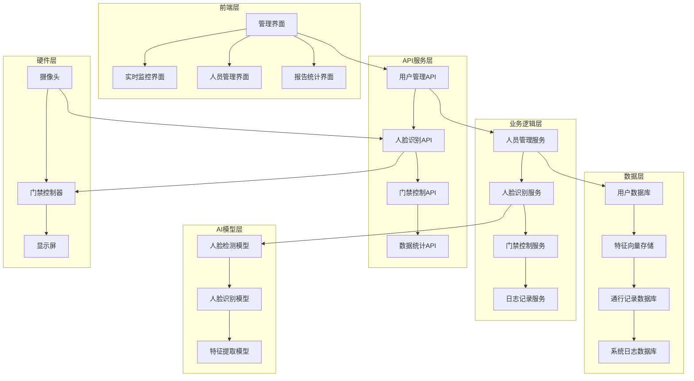

# 人脸识别系统设计文档

## 概述

本文档描述了基于facecap数据集的人脸识别门禁系统的详细设计。系统采用深度学习技术进行人脸识别，结合Web应用提供完整的门禁管理功能。系统支持500个人员的人脸识别，具备实时识别、人员管理、门禁控制和系统监控等核心功能。

## 架构设计

### 系统整体架构



### 技术栈选择

- **后端框架**: FastAPI (Python) - 高性能异步API框架
- **深度学习框架**: PyTorch - 灵活的深度学习框架
- **人脸检测**: MTCNN - 多任务级联卷积网络
- **人脸识别**: ArcFace + ResNet50 - 高精度人脸识别模型
- **数据库**: PostgreSQL - 关系型数据库存储结构化数据
- **向量数据库**: Faiss - 高效的相似度搜索
- **前端框架**: React + TypeScript - 现代化Web界面
- **消息队列**: Redis - 缓存和任务队列
- **容器化**: Docker - 应用部署和管理

## 组件和接口设计

### 1. 人脸识别核心组件

#### FaceDetector 类
```python
class FaceDetector:
    def __init__(self, model_path: str)
    def detect_faces(self, image: np.ndarray) -> List[BoundingBox]
    def align_face(self, image: np.ndarray, bbox: BoundingBox) -> np.ndarray
```

#### FaceRecognizer 类
```python
class FaceRecognizer:
    def __init__(self, model_path: str)
    def extract_features(self, face_image: np.ndarray) -> np.ndarray
    def compare_features(self, feat1: np.ndarray, feat2: np.ndarray) -> float
    def identify_person(self, features: np.ndarray, threshold: float = 0.85) -> Optional[PersonID]
```

#### ModelTrainer 类
```python
class ModelTrainer:
    def __init__(self, config: TrainingConfig)
    def prepare_dataset(self, data_path: str) -> DataLoader
    def train_model(self, train_loader: DataLoader, val_loader: DataLoader) -> None
    def evaluate_model(self, test_loader: DataLoader) -> Dict[str, float]
    def save_model(self, model_path: str) -> None
```

### 2. 数据管理组件

#### PersonManager 类
```python
class PersonManager:
    def add_person(self, person_info: PersonInfo, face_images: List[np.ndarray]) -> PersonID
    def update_person(self, person_id: PersonID, updates: Dict) -> bool
    def delete_person(self, person_id: PersonID) -> bool
    def get_person(self, person_id: PersonID) -> Optional[PersonInfo]
    def search_persons(self, query: SearchQuery) -> List[PersonInfo]
```

#### AccessLogger 类
```python
class AccessLogger:
    def log_access_attempt(self, person_id: Optional[PersonID], timestamp: datetime, 
                          confidence: float, success: bool) -> None
    def get_access_logs(self, filters: LogFilters) -> List[AccessLog]
    def generate_report(self, report_type: ReportType, date_range: DateRange) -> Report
```

### 3. 门禁控制组件

#### AccessController 类
```python
class AccessController:
    def __init__(self, hardware_interface: HardwareInterface)
    def process_access_request(self, person_id: PersonID) -> AccessResult
    def open_door(self, duration: int = 5) -> bool
    def trigger_alarm(self, alarm_type: AlarmType) -> None
    def get_door_status(self) -> DoorStatus
```

### 4. API接口设计

#### 人脸识别API
```python
@app.post("/api/face/recognize")
async def recognize_face(image: UploadFile) -> RecognitionResult

@app.post("/api/face/register")
async def register_face(person_info: PersonInfo, images: List[UploadFile]) -> PersonID

@app.get("/api/face/features/{person_id}")
async def get_face_features(person_id: PersonID) -> FaceFeatures
```

#### 人员管理API
```python
@app.post("/api/persons")
async def create_person(person: PersonCreate) -> PersonInfo

@app.get("/api/persons/{person_id}")
async def get_person(person_id: PersonID) -> PersonInfo

@app.put("/api/persons/{person_id}")
async def update_person(person_id: PersonID, updates: PersonUpdate) -> PersonInfo

@app.delete("/api/persons/{person_id}")
async def delete_person(person_id: PersonID) -> bool
```

#### 门禁控制API
```python
@app.post("/api/access/request")
async def request_access(access_request: AccessRequest) -> AccessResult

@app.get("/api/access/status")
async def get_access_status() -> AccessStatus

@app.get("/api/access/logs")
async def get_access_logs(filters: LogFilters) -> List[AccessLog]
```

## 数据模型设计

### 数据库表结构

#### persons 表
```sql
CREATE TABLE persons (
    id SERIAL PRIMARY KEY,
    employee_id VARCHAR(50) UNIQUE NOT NULL,
    name VARCHAR(100) NOT NULL,
    department VARCHAR(100),
    position VARCHAR(100),
    access_level INTEGER DEFAULT 1,
    is_active BOOLEAN DEFAULT TRUE,
    created_at TIMESTAMP DEFAULT CURRENT_TIMESTAMP,
    updated_at TIMESTAMP DEFAULT CURRENT_TIMESTAMP
);
```

#### face_features 表
```sql
CREATE TABLE face_features (
    id SERIAL PRIMARY KEY,
    person_id INTEGER REFERENCES persons(id),
    feature_vector BYTEA NOT NULL,
    image_path VARCHAR(255),
    quality_score FLOAT,
    created_at TIMESTAMP DEFAULT CURRENT_TIMESTAMP
);
```

#### access_logs 表
```sql
CREATE TABLE access_logs (
    id SERIAL PRIMARY KEY,
    person_id INTEGER REFERENCES persons(id),
    timestamp TIMESTAMP DEFAULT CURRENT_TIMESTAMP,
    location VARCHAR(100),
    access_granted BOOLEAN,
    confidence_score FLOAT,
    image_path VARCHAR(255),
    notes TEXT
);
```

#### system_logs 表
```sql
CREATE TABLE system_logs (
    id SERIAL PRIMARY KEY,
    level VARCHAR(20),
    message TEXT,
    component VARCHAR(50),
    timestamp TIMESTAMP DEFAULT CURRENT_TIMESTAMP,
    metadata JSONB
);
```

### 特征向量存储

使用Faiss库构建高效的向量索引：

```python
class FeatureIndex:
    def __init__(self, dimension: int = 512):
        self.index = faiss.IndexFlatIP(dimension)  # 内积索引
        self.person_ids = []
    
    def add_features(self, features: np.ndarray, person_ids: List[int]) -> None
    def search(self, query_features: np.ndarray, k: int = 1) -> Tuple[np.ndarray, np.ndarray]
    def remove_person(self, person_id: int) -> None
    def save_index(self, path: str) -> None
    def load_index(self, path: str) -> None
```

## 错误处理设计

### 异常类型定义

```python
class FaceRecognitionError(Exception):
    """人脸识别相关异常基类"""
    pass

class FaceNotDetectedError(FaceRecognitionError):
    """未检测到人脸"""
    pass

class MultipleFacesError(FaceRecognitionError):
    """检测到多个人脸"""
    pass

class LowQualityImageError(FaceRecognitionError):
    """图像质量过低"""
    pass

class PersonNotFoundError(FaceRecognitionError):
    """人员未找到"""
    pass

class AccessDeniedError(FaceRecognitionError):
    """访问被拒绝"""
    pass
```

### 错误处理策略

1. **人脸检测失败**: 提示用户调整位置，重新检测
2. **识别置信度低**: 记录日志，提示手动验证
3. **数据库连接失败**: 使用本地缓存，异步重连
4. **模型加载失败**: 使用备用模型，发送告警
5. **硬件设备异常**: 切换到手动模式，通知维护

## 测试策略

### 单元测试

- 人脸检测准确性测试
- 特征提取一致性测试
- 数据库操作正确性测试
- API接口功能测试

### 集成测试

- 端到端识别流程测试
- 门禁控制集成测试
- 数据同步一致性测试
- 性能压力测试

### 性能测试指标

- 人脸识别响应时间 < 2秒
- 系统并发处理能力 > 10 QPS
- 识别准确率 > 95%
- 系统可用性 > 99.5%

### 测试数据集

- 使用facecap测试集进行模型评估
- 构建边界案例测试集（光线、角度、遮挡等）
- 创建性能基准测试数据
- 准备安全渗透测试场景